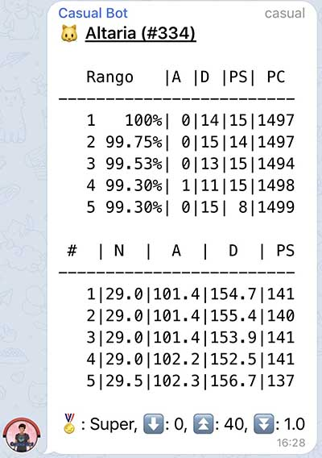

# **Casual Bot Telegram Bot**


Casual Bot is a project I started to learn Python and SQL. It runs on a Raspberry Pi 3 Model B+.

It's a Telegram Bot which users can interact with by sending messages.

The bot has had a lot of features added since its initial release. Some of them were suggested by people who use the bot.

Right now the bot is used by more than 200 groups.

## **Index**
* [Event list](#event-list)
    * [Channels available](#channels-available)
    * [How do events work?](#how-do-events-work)
        * [Database info](#database-info)
        * [Event list sorting criteria](#event-list-sorting-criteria)
        * [Custom messages](#custom-messages)
* [Time zones](#time-zones)
* [News](#news)
* [Pokédex](#pokédex)
* [Alerts](#alerts)

# **Event list**
Send an event list by typing the command /events (disabled by default in groups and only available in those with +16 members).

Daily notification is sent with the event list at 8:50 and also when an event begins or ends.

The bot handles the events for multiple time zones. Each time zone has its own channel and when the bot sends a message to a channel it's also forwarded to the groups that match the time zone and have the option enabled.


*Example of a channel*

## **Channels available**

* **Europe/Madrid** *(+500 subscribers)***:** [@pokemongoeventos](https://t.me/pokemongoeventos)
* **Portugal** *(+800 subscribers)***:** [@pokemongoeventosPT](https://t.me/pokemongoeventosPT)
* **Central European Time:** [@pokemongoeventsCET](https://t.me/pokemongoeventsCET)
* **Atlantic/Canary:** [@pokemongoeventosCanarias](https://t.me/pokemongoeventosCanarias)

## **How do events work?**
Since the events is the most used function of the bot I'd like to explain it in more depth.

### **Database info**
The info about the events is stored in a database (SQL - MariaDB) and the columns of the table are:

1. **ID:** unique number for each event.
2. **Notified Status:** 0 if event has not started, 1 if it has started and 2 if it's ended in a time zone.
3. **Begin Date**: stored for time zone Europe/Madrid 
4. **End Date**: stored for time zone Europe/Madrid 
5. **Event Text:** title of the event in Spanish.
6. **English Event Text**: title of the event in English. Can be null (in this case the Spanish text is translated).
7. **Event Link**
8. **Local Event***: boolean value. If True the dates are assigned the local time zone. If False the dates timezone is changed to the local time zone.
9. **Time Delta Southern hemisphere****: some events (Community Day) start at a different hour in the Southern hemisphere. This value is the delta between the 2 hours.

\*If an event starts locally at 11:00 in every time zone then a value of 1 is set for *Local Event* (0 if not). If an event starts simultaneously at 22:00 (Europe/Madrid) then in Portugal starts at 21:00.

\**Hour in SH = Hour in NH + Time Delta

An event checker is run at minutes :00, :30 and :59 to check any changes and if so notify it and change the database.

If an event has ended in all time zones (i.e. Notified Status = 2 for all time zones) it's automatically deleted from the database.

The events are manually added, edited and deleted using some commands sent via a Telegram conversation with the bot.

### **Event list sorting criteria**
1. Custom messages
2. Events that end today
3. Events that begin today
4. Events that end tomorrow
5. Events that begin tomorrow
6. Events that have started (and don't match 1. or 3.)
7. Events that have not started (and don't match 2. or 4.)
8. "Manual" events

### **Custom messages**
Pieces of text that may appear at the begining of the list. They are save into a JSON file with this structure:

```
{
    "name": "Name",
    "announce_date_begin": "2020-01-06 0:00:00",
    "announce_date_end": "2020-01-10 23:59:59",
    "text": {
        "ES": "Hola",
        "EN": "Hello"
        ...
    }
}
```

* **name:** not used in the code. It's just to differentiate between elements.
* **announce_date_begin:** local date when the message should be begin to be displayed.
* **announce_date_end:** local date when the message should be stop to be displayed.
* **text:** dictionary with the texts in each language. If the key for a language is not included then no custom message is displayed for time zones with that language.


*Example of a custom message*

# **Time zones**
Dealing with time zones is really important for the events to work. Here is an example of the info stored for the time zone "Central European Time":

```
{
    "title": "Central European Time",
    "name": "Europe/Paris",
    "language": "EN",
    "dateformat": "month-day",
    "hemisphere": "North",
    "dailyNotificationEnabled": True,
    "eventNotificationEnabled": True,
    "customMessagesEnabled": True,
    "channel_alias": "@pokemongoeventsCET",
    "channel_id": -1001...
}
```

* **title:** text to display in the header of the event list (an also in settings).
* **name:** name of the time zone.
* **language:** since the messages are sent to a channel and then forwarded, each time zone has a language associated.
* **dateformat:** the order of the language strings are different in some languages.
* **hemisphere:** North or South. Some events start at a different time depending on the hemisphere.
* **dailyNotificationEnabled:** toggle to enable/disable daily event list message.
* **eventNotificationEnabled:** toggle to enable/disable events notification messages.
* **customMessagesEnabled:** toggle to enable/disable custom messages.
* **channel_alias:** this is put at the end of the list. If key not present then nothing is added.
* **channel_id:** unique id (given by Telegram) of the channel associated.

**dailyNotificationEnabled** and **eventNotificationEnabled** are mainly used testing purposes. There are also "global" toggles called **dailyNotificationGlobalEnabled** and **eventNotificationGlobalEnabled**.

# **News**
Forward news from some channels (only in groups with +16 members).

The bot checks for edited messages ands forwards then again if the original message is not older than a given time.


*Example of a forwarded news*

# **Pokédex**
With the commands /casualdex, /pokemoncodes y /pokemonpvp you can check information about a Pokémon (disabled by default in groups).



*Example of /pokemonpvp*

Commands casualdex and pokemonpvp also support Telegram Inline Mode. This is especially useful if you want to check an IV combination with the command pokemonpvp because there's no need to send a message.


*Example of Inline Mode*

# **Alerts**
Send predefined messages periodically. For more help write /alertcasual (only in groups).


*Alerts help*


*Example of an alerts*
